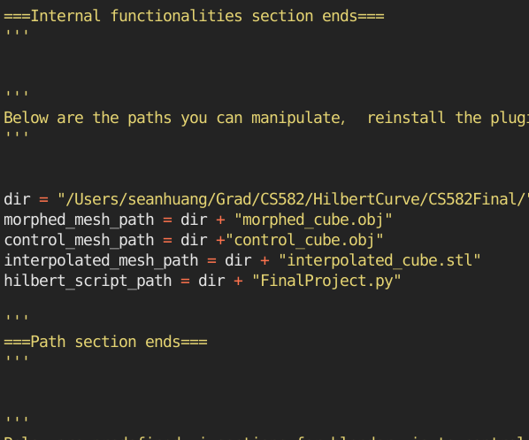
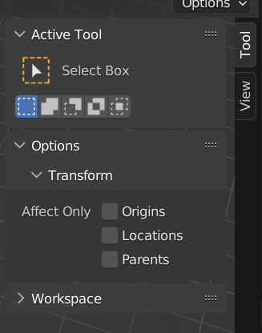
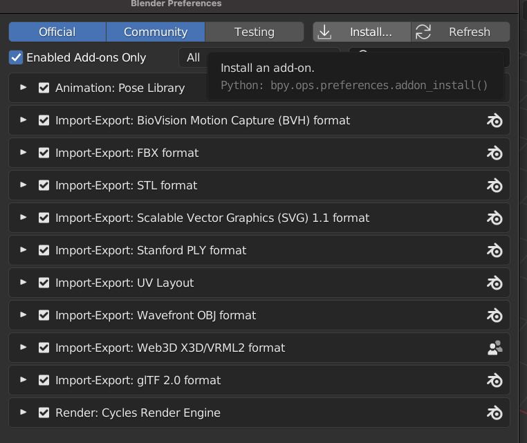
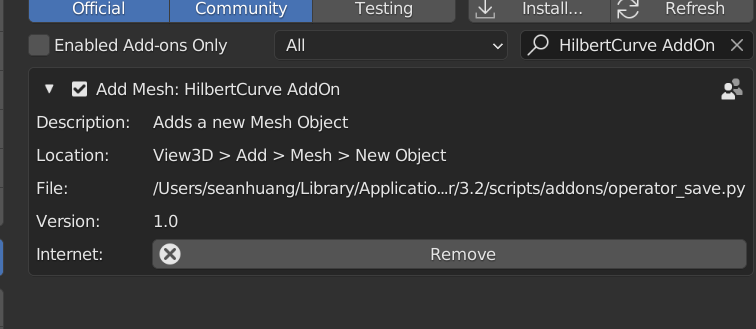
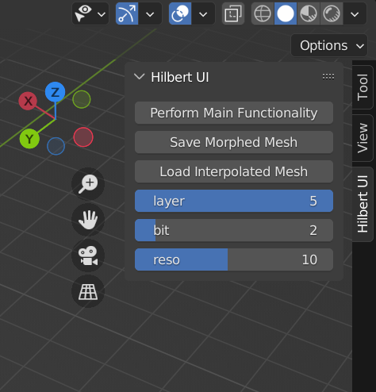
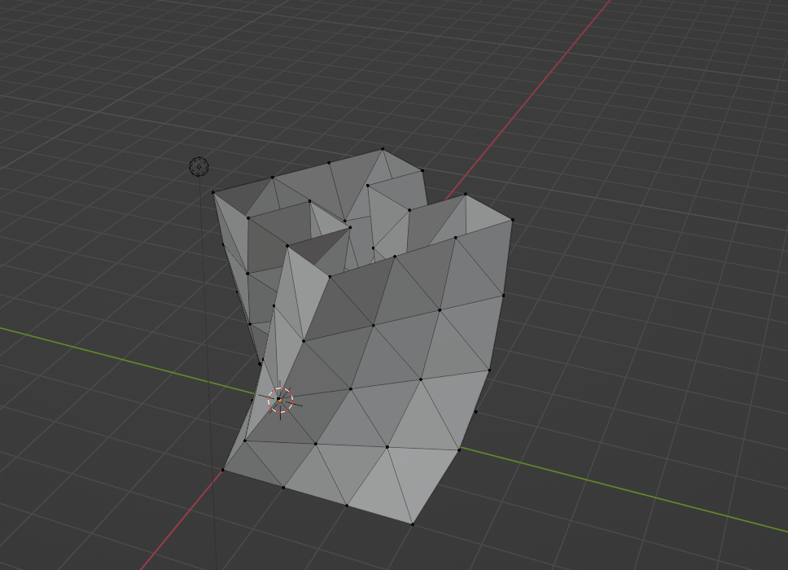
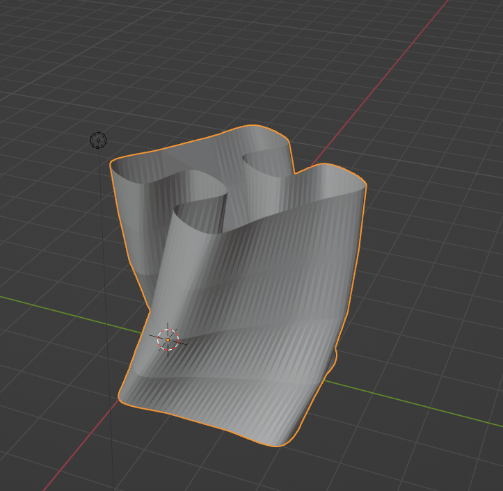
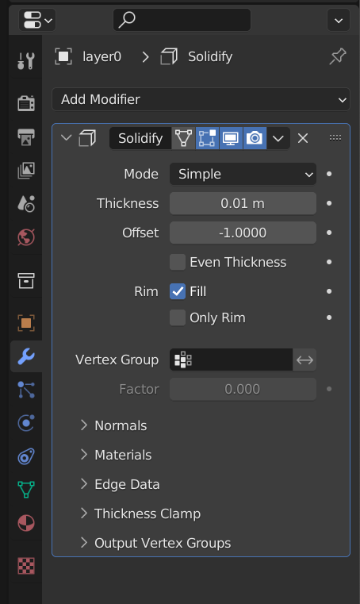
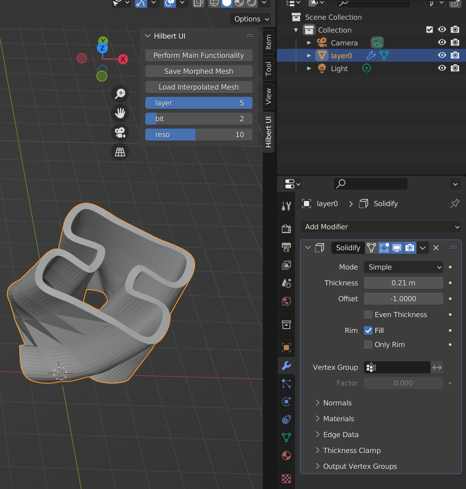
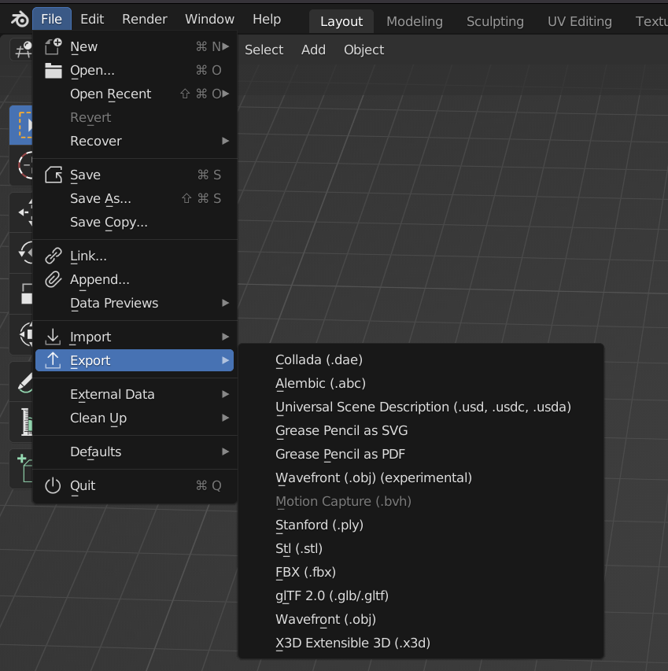

# Boston University CAS 2023 Spring CS582 Final Project Series: Hilbert Curve Generation and Interpolation

## Usage:
### 1. Clone repository and use an editor to edit operator_save.py to change your working directory

   

### 2. At the beginning, the default vertical side bar should look like this.
 

### 3. Install the plugin by Going to Blender's Edit => Preferences => Add-On => Install

### 4. Find your editted operator_save.py and click Install and tick the box 

### Your side bar should now look like this:

### 5. To start your mesh generation, move the top 2 slider bars to change orders and layers
### 6. click "Perform Main Functionality" and a mesh should be create in scene

### 7. Do transformations on the control points of hilbert curve

   

### 8. Save your morphed mesh by clicking "Save Morphed Mesh"(you can save without morphing)

 

### 9. Adjust the amout of points you want to add between control points by sliding "reso" and click "Load Interpolated Mesh " to create the final mesh

 

#### Note: possibly due to Blener's IO issue, sometimes, saving the morphed mesh could result in werid value that will break the interpolation. If that happens just recreate your mesh by clicking all three buttons, it should take only 1-2 try to create the interpolated stl mesh.  

### 10. To prepare the print, select the mesh and add an modifier to the mesh:

 

### 11. Adjust the thickness and export your stl mesh for the print.

   
   

